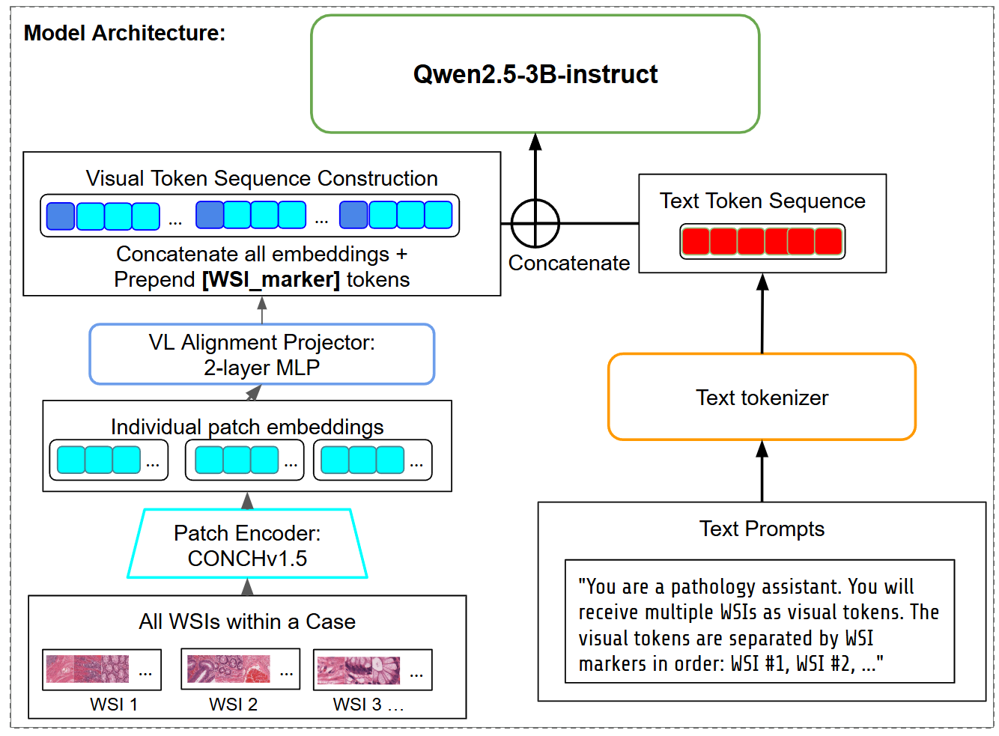
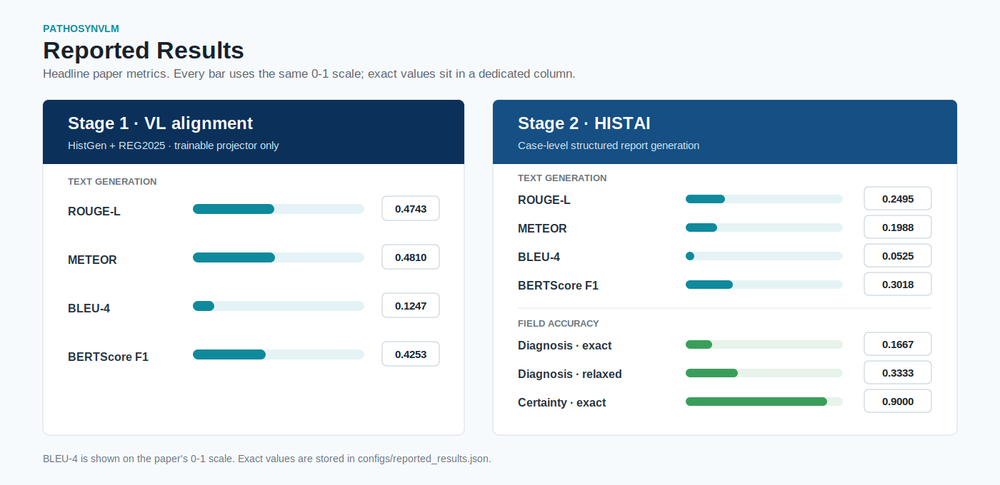

# PathoSynVLM: Case-Level Pathology Report Generation

[](https://arxiv.org/abs/2605.30716)
[](https://www.python.org/)
[](LICENSE)
[](weights/README.md)



**PathoSynVLM is a simple token-efficient vision-language model for generating case-level pathology synoptic reports from one or more whole-slide images.** It keeps the pathology patch encoder frozen, learns a compact visual-to-language aligner, and uses a Qwen2.5 instruction decoder to produce structured report fields:

```text
Diagnosis: ...
Certainty: ...
Conclusion: ...
```

Code and model-release utilities for:

> **Simple Token-Efficient Vision-Language Model for Case-level Pathology Synoptic Report Generation**  
> Zhiyuan Yang, Jiahao Cheng, Vincent Quoc-Huy Trinh, Mahdi S. Hosseini  
> arXiv:2605.30716

Paper: https://arxiv.org/abs/2605.30716

## News

- **2026/06** Repository prepared with paper-aligned training, evaluation, inference, and weight-export utilities.
- **2026/05** PathoSynVLM preprint released on arXiv.

## Table Of Contents

- [Quick Start](#quick-start)
- [Model Weights](#model-weights)
- [Headline Results](#headline-results)
- [Method Overview](#method-overview)
- [Data And Embeddings](#data-and-embeddings)
- [Run The Paper Pipeline](#run-the-paper-pipeline)
- [Repository Map](#repository-map)
- [SLURM Jobs](#slurm-jobs)
- [Notes From The Authors](#notes-from-the-authors)
- [Citation](#citation)
- [License](#license)

## Quick Start

### Option A: Use The Released Model

This is the path for users who want to generate reports without retraining.

The repository intentionally does **not** commit model weights to Git. The authors should upload the exported weight package to an artifact host such as Hugging Face, GitHub Releases, or institutional storage. After upload, users should download that package into:

```text
weights/pathosynvlm-stage2-main/
```

Expected layout:

```text
weights/pathosynvlm-stage2-main/
  config.json
  vlm_state.pt
  tokenizer/
  llm/
  best_checkpoint_summary.json
```

Example after the model repository is uploaded:

```bash
# Example only. Replace with the final author-uploaded model repo.
hf download <ORG_OR_USER>/pathosynvlm-stage2-main \
  --local-dir weights/pathosynvlm-stage2-main

python scripts/generate_case_report.py \
  --weights weights/pathosynvlm-stage2-main \
  --embeddings data/embeddings/HISTAI-skin-b2/conch_v15/5x_512/patches/example_1.h5 \
               data/embeddings/HISTAI-skin-b2/conch_v15/5x_512/patches/example_2.h5 \
  --output_json report.json
```

Users **do not need to create weights themselves** for inference once the authors upload the release package. The export script exists so the authors, or users who retrain from scratch, can convert a training run into that package.

### Option B: Train From Scratch

This is the path for rerunning the paper training and evaluation pipeline end to end.

```bash
conda create -n pathosynvlm python=3.11 -y
conda activate pathosynvlm
pip install -e .
```

Then follow:

1. Download the datasets described in [docs/data.md](docs/data.md).
2. Generate CONCHv1.5 patch embeddings using the layout in [docs/embeddings.md](docs/embeddings.md).
3. Prepare metadata with `scripts/prepare_stage1_metadata.py` and `scripts/prepare_histai_metadata.py`.
4. Train Stage 1 alignment.
5. Train Stage 2 HISTAI report generation.
6. Evaluate and compare against [configs/reported_results.json](configs/reported_results.json).
7. Optionally export your trained checkpoint with `scripts/export_release_weights.py`.

## Model Weights

There are two different weight workflows:

| Workflow | Who uses it | What happens |
|---|---|---|
| **Download released weights** | Most users | Download the author-uploaded `weights/pathosynvlm-stage2-main/` package and run inference or evaluation directly. |
| **Export weights** | Authors or retrainers | Run `scripts/export_release_weights.py` on a completed Stage 2 training run to create the inference package. |

The paper Stage 2 run used `unfreeze_llm_base=true`, so a LoRA adapter alone is not enough for exact release inference. The Hugging Face package contains a merged/full Hugging Face LLM directory plus `vlm_state.pt` for the aligner and WSI marker tensors.

Export command for the authors:

```bash
python scripts/export_release_weights.py \
  --run_dir runs/stage2_main \
  --output_dir weights/pathosynvlm-stage2-main \
  --overwrite
```

Read [docs/weights.md](docs/weights.md) for the download/export distinction.
The Hugging Face upload root and validation steps are in [docs/huggingface_release.md](docs/huggingface_release.md).

The release model card is in [MODEL_CARD.md](MODEL_CARD.md).

## Headline Results



### Stage 1 Alignment

| ROUGE-L | METEOR | BLEU-4 | BERTScore F1 |
|---:|---:|---:|---:|
| 0.4743 | 0.4810 | 0.1247 | 0.4253 |

### Stage 2 HISTAI Main Result

| ROUGE-L | METEOR | BLEU-4 | BERTScore F1 | Diagnosis Exact | Diagnosis Relaxed | Certainty |
|---:|---:|---:|---:|---:|---:|---:|
| 0.2495 | 0.1988 | 0.0525 | 0.3018 | 0.1667 | 0.3333 | 0.9000 |

The training logs use sacreBLEU percentage scale, so `5.2512` in JSON corresponds to `0.0525` in the paper.

## Method Overview

PathoSynVLM follows a two-stage recipe:

1. **Stage 1: token alignment.** Train only a two-layer MLP aligner that maps frozen CONCHv1.5 patch embeddings into the Qwen2.5-3B-Instruct hidden space. The LLM and pathology encoder stay frozen.
2. **Stage 2: case-level report finetuning.** Finetune on HISTAI case-report pairs with one or more WSIs per case. WSI marker tokens help the decoder separate evidence from different slides.

This repository sticks to paper-relevant experiments. Extra internal follow-up work from `VLM_MVP` is intentionally excluded, with audit notes preserved in [audit/internal_repo_audit.md](audit/internal_repo_audit.md).

## Data And Embeddings

Expected data sources:

- HistGen: https://github.com/dddavid4real/HistGen and https://huggingface.co/datasets/david4real/HistGen
- REG2025: https://reg2025.grand-challenge.org/
- HISTAI: https://github.com/HistAI/HISTAI

Expected local layout:

```text
data/
  raw/
    histgen/annotation_update.json
    reg2025/train.json
    histai/standardized_metadata_fixed.json
  stage1/
    merged_metadata_3datasets_filtered_conch_v15.json
  histai/
    standardized_metadata_fixed_filtered_5x_512.json
  embeddings/
    HistGen-train/conch_v15/5x_512/patches/*.h5
    REG_dataset/REG_train/conch_v15/5x_512/patches/*.h5
    HISTAI-*/conch_v15/5x_512/patches/*.h5
```

Each H5 file should contain:

```text
/features/conch_v15  # shape: (num_patches, 768)
```

See [docs/data.md](docs/data.md) and [docs/embeddings.md](docs/embeddings.md) for details.

## Run The Paper Pipeline

Prepare Stage 1 metadata:

```bash
python scripts/prepare_stage1_metadata.py \
  --histgen-json data/raw/histgen/annotation_update.json \
  --reg-json data/raw/reg2025/train.json \
  --dataset-embeddings-root data/embeddings \
  --patch-level 5x_512
```

Prepare Stage 2 metadata:

```bash
python scripts/prepare_histai_metadata.py \
  --metadata-standardized-json data/raw/histai/standardized_metadata_fixed.json \
  --dataset-embeddings-root data/embeddings \
  --patch-levels 5x_512
```

Train Stage 1:

```bash
python scripts/train_stage1_alignment.py \
  --metadata_json data/stage1/merged_metadata_3datasets_filtered_conch_v15.json \
  --dataset_embeddings_root data/embeddings \
  --datasets histgen,reg_dataset \
  --output_dir runs/stage1_alignment
```

Train Stage 2 main paper run:

```bash
python scripts/train_stage2_histai.py \
  --metadata_standardized_json data/histai/standardized_metadata_fixed_filtered_5x_512.json \
  --dataset_embeddings_root data/embeddings \
  --aligner_init runs/stage1_alignment/best_aligner_weights.pt \
  --output_dir runs/stage2_main \
  --prompt_style double \
  --max_text_length 384 \
  --max_vision_tokens 4096 \
  --use_wsi_markers \
  --unfreeze_llm_base \
  --gradient_checkpoint
```

Evaluate:

```bash
python scripts/evaluate_checkpoint.py \
  --finetune_run_dir runs/stage2_main \
  --dataset_scope histai \
  --histai_metadata_standardized_json data/histai/standardized_metadata_fixed_filtered_5x_512.json \
  --dataset_embeddings_root data/embeddings \
  --output_json runs/stage2_main/eval_histai.json
```

Full paper-aligned arguments are stored in [configs/](configs), and the detailed run guide is in [docs/paper_pipeline.md](docs/paper_pipeline.md).

## Repository Map

| Path | Purpose |
|---|---|
| `pathosynvlm/` | Model, data loaders, alignment modules, and metrics. |
| `scripts/` | Metadata prep, training, evaluation, inference, and weight export entry points. |
| `configs/` | Paper-aligned configs and reported result values. |
| `docs/` | Data, embedding, paper-pipeline, weight-release, Hugging Face release, and release-checklist docs. |
| `MODEL_CARD.md` | Intended use, limitations, and release-weight notes for the model. |
| `slurm/` | Cluster job templates. |
| `assets/` | README figures. |
| `audit/` | Internal provenance notes for what was carried over or omitted. |
| `weights/` | Placeholder for externally downloaded model artifacts. |

## SLURM Jobs

On FIR or another SLURM cluster, run inside a compute allocation rather than on the login node. Templates are provided:

```bash
sbatch slurm/stage1_alignment.sbatch
sbatch slurm/stage2_histai.sbatch
sbatch slurm/evaluate.sbatch
```

For interactive work:

```bash
salloc --account=<account> --time=04:00:00 --gres=gpu:1 --cpus-per-task=4 --mem=64G
srun --pty bash -l
conda activate pathosynvlm
```

## Notes From The Authors

- This repo is scoped to the experiments reported in the paper, not every internal follow-up run.
- `PathText` support remains as an optional compatibility path, but the Stage 1 default is HistGen + REG2025.
- The WSI-marker ablation has a preserved audit caveat because one paper row label and the observed internal run arguments do not fully agree. See [configs/stage2_wsi_marker_ablation.json](configs/stage2_wsi_marker_ablation.json) and [audit/internal_repo_audit.md](audit/internal_repo_audit.md).
- Raw WSIs, extracted H5 embeddings, checkpoints, and released weights are intentionally kept outside Git.

## Citation

```bibtex
@misc{yang2026simpletokenefficientvisionlanguage,
  title={Simple Token-Efficient Vision-Language Model for Case-level Pathology Synoptic Report Generation},
  author={Zhiyuan Yang and Jiahao Cheng and Vincent Quoc-Huy Trinh and Mahdi S. Hosseini},
  year={2026},
  eprint={2605.30716},
  archivePrefix={arXiv},
  primaryClass={cs.CV},
  url={https://arxiv.org/abs/2605.30716}
}
```

## License

This repository uses **Creative Commons Attribution-NonCommercial-ShareAlike 4.0 International (CC BY-NC-SA 4.0)**, matching the license used by MOOZY. See [LICENSE](LICENSE).

Datasets, pretrained third-party models, and externally hosted model weights may have separate terms.
